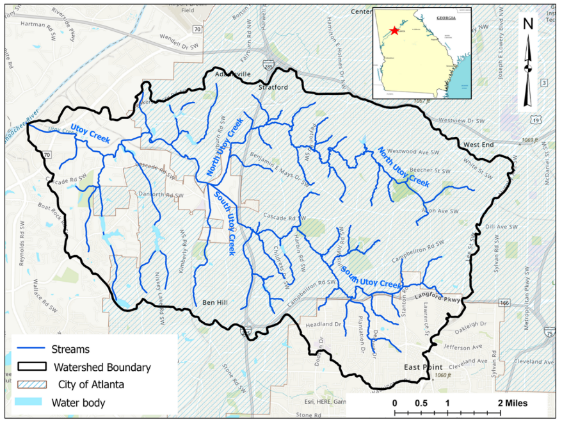
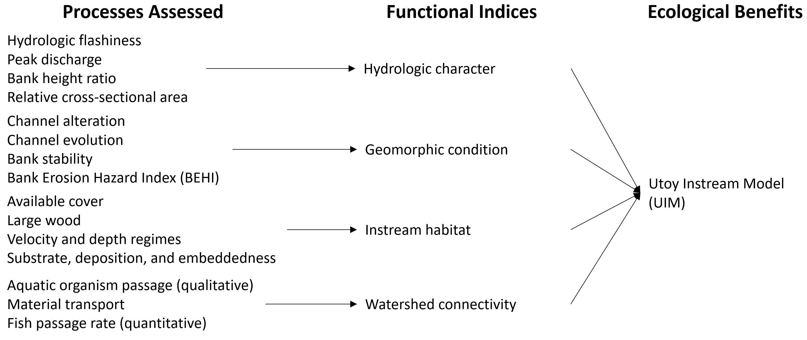
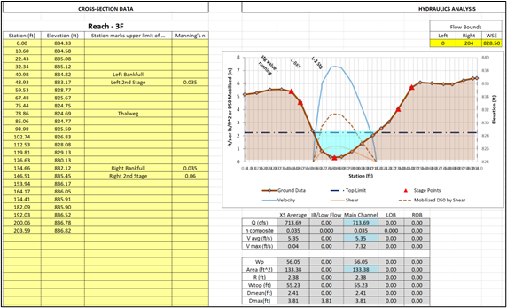
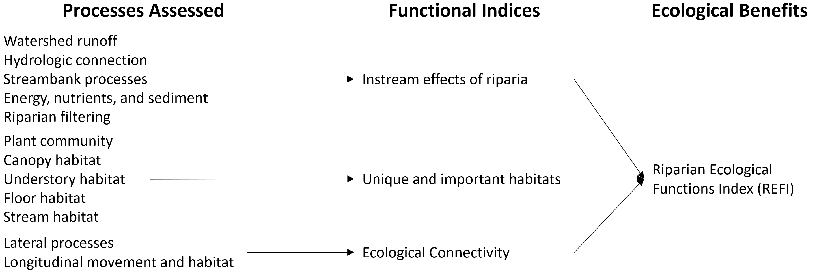

**Corresponding Author**:  
Kyle McKay, PhD, PE  
Environmental Laboratory  
U.S. Army Corps of Engineers  
Email: kyle.mckay@usace.army.mil

**Model Accessibility**: An interactive version of this report may be accessed [here](https://usace-wrises.github.io/UtoyEcoMod/). The underlying numerical code as well as an MS Word version of this analysis may be downloaded from [this github repository](https://github.com/USACE-WRISES/UtoyEcoMod.git).

**DISCLOSURE**: This website represents a preliminary and working version of decision models for a stream restoration study in Utoy Creek, Atlanta, Georgia. The project is led by the Mobile District of the U.S. Army Corps of Engineers (USACE) in partnership with the City of Atlanta. This site **DOES NOT** reflect agency findings or outcomes, and this is merely intended as documentation of methods and working notes for internal use. Please refer to the project manager for the Utoy Creek study, Alex Smith (alexandria.n.smith@usace.army.mil), for up-to-date information about the project. A final version of this report will ultimately be included as an appendix to the more detailed feasibility study report.  


```{r options, include=FALSE}
#Markdown options
knitr::opts_chunk$set(echo=FALSE, warning=FALSE, message = FALSE) 

##########
#Clear local memory
rm(list=ls(all=TRUE))

##########
#Load R package containing CEICA
library(ecorest)

#Load R package containing cost engineering functions
library(EngrEcon)

#Load R package containing color palette
library(viridis)

##########
#IMPORT ALL UTOY DATA

#Import ecological modeling inputs
eco <- read.csv("Utoy_Phase 2_EcoInputs_2024-08-05_EcoIn.csv", header=TRUE, dec=".", na.strings="NA", stringsAsFactors = FALSE)

#Import cost data inputs
cost <- read.csv("Utoy_Phase 2_EcoInputs_2024-08-05_CostIn.csv", header=TRUE, dec=".", na.strings="NA", stringsAsFactors = FALSE)
```


# **1. Introduction**   

The Utoy Creek watershed drains the southwest portion of the City of Atlanta into the Chattahoochee River (Figure 1). This small-to-middle order stream is within the Piedmont region of the southeastern United States, and Utoy Creek exhibits many common characteristics of regional streams such as historical channel degradation due to poor sediment management as well  modern challenges like flashy runoff from urban development. The majority of Utoy Creek's watershed is situated within City of Atlanta boundaries; however, downstream portions of the watershed are within Fulton County. Two main tributaries, North and South Utoy Creeks, unite to form the main stem approximately five miles upstream the Chattahoochee River (EPA, 2016). The total combined length of the main stem and primary tributaries is approximately 22 miles (Walker, 2016).  Including sub-tributaries, the total length of stream is over 50 miles in the Utoy Creek watershed. The total drainage basin is approximately 33.7 square miles with 64% developed and 18% impervious.  



In partnership with the City of Atlanta, the USACE's Mobile District is leading a feasibility study of potential stream restoration actions in the Utoy Creek watershed. The study is authorized through the USACE's continuing authorities program for aquatic ecosystem restoration (Section 206, WRDA 1996). In summer 2023, the project development team conducted preliminary project planning activities such as identification of problems and opportunities, setting ecosystem restoration objectives, and screening potential restoration sites. From fall 2023 to summer 2024, the project development team advanced restoration planning through actions such as field data collection, design of alternatives, ecological modeling, cost estimation, analysis of socio-economic benefits, and public and interagency meetings. 

This report summarizes the development and application of ecological models to inform decision making in the Utoy Creek ecosystem restoration study. The report briefly describes the project planning framework for the feasibility study because ecological models were designed to align with project objectives and study needs. We then describe development of two ecological models addressing instream and riparian outcomes. This model description mirrors the requirements for USACE's model certification program (EC-1105-2-412), although certified models are not required for studies in the continuing authorities program. The models are then applied to assess the existing conditions and multiple futures with project alternatives. This report is written as part of the broader feasibility study, and additional detail is provided in other documents and reports (e.g., the [decision support appendix](https://usace-wrises.github.io/UtoyDecisions/)). 


# **2. Project Planning Framework**   

The ecological models presented here were developed and applied in the context of the Utoy Creek ecosystem restoration feasibility study. As such, context of the broader planning approach helps understand choices made in model development. Specifically, models were designed around the following project objectives to maximize alignment between plan formulation and plan evaluation. These objectives were developed iteratively with the USACE project development team and the cost-share sponsor as well as with input from technical and non-technical stakeholders at a charrette in May 2023.  

*Overarching objective: Improve instream conditions suitable for a diversity of aquatic organisms (e.g., fish, crayfish, salamanders, benthic macroinvertebrates, turtles)*.  

- Restore channel geomorphic conditions to less disturbed conditions.  
- Reduce sediment loading from the stream bed and banks.  
- Increase instream habitat for a diverse assemblage of local fauna.  
- Increase connectivity of movement corridors for aquatic species

*Overarching objective: Improve riparian conditions supportive of a diverse aquatic and riparian community*.  

- Restore natural sources of organic carbon (i.e., energy) within the system.  
- Increase floodplain connectivity to support biogeochemical cycling.  
- Improve temperature and light regimes.  
- Increase riparian habitat to support native biodiversity.  
- Increase connectivity of movement corridors for riparian species

*Overarching Objective: Restore flow regimes to a best attainable condition*.  

- Decrease peak flows.  
- Decrease hydrologic flashiness.  
- Improve watershed capacity to attenuate high flows.

*Secondary Objectives: Pursue socio-economic outcomes while restoring instream and riparian systems*.  

- Increase resiliency to disturbances (e.g., watershed development, climate change, large floods).  
- Promote social benefits and equity.  
- Promote aesthetics and recreation.  
- Improve water quality (e.g., TSS, zinc, nutrients).

In pursuit of these objectives, different information was required as planning proceeded from early watershed problem screening to feasibility-level design. The USACE project development team developed a three-phase approach to analysis of the Utoy Creek watershed restoration (Table 1). In phase 1, activities focused on screening sites to a focal set of locations aligned with USACE objectives. This phase used a suite of high-level assumptions and preliminary data on ecological benefits and costs to reduce 60+ potential restoration locations to a more workable 20 sites for more detailed analysis. Phase 2 focused on feasibility-scale analysis of these 20 sites including collection of additional field and analytical data, development of conceptual designs, execution of ecological models, and estimation of cost. This phase ultimately focused on producing site-scale recommendations of restoration actions. Phase 3 examined the portfolio of recommended actions at the watershed-scale, which analysis of ecological outcomes as well as other project effects (i.e., development of a narrative about the "comprehensive" socio-economic benefits of an investment). These phases required a series of assumptions regarding each analytical step, which are briefly presented in Table 1 relative to ecological modeling topics. Additional information on discipline-specific assumptions can be found elsewhere in feasibility documents.

```{r echo=FALSE}
#Create empty table
Table01 <- as.data.frame(matrix(NA, nrow = 6, ncol = 4))
colnames(Table01) <- c("Scoping Issue", "Site Screening (Aug 2023)", "Site-Scale Analysis (Chapter 3)", "Watershed-Scale Analysis (Chapter 4)")

#Specify rows of the table
Table01[1,] <- c("Primary purpose of analysis", "Screen out sites to a smaller set for more detailed data collection and analysis", "Identify cost-effective restoration actions at each site.", "Develop an effective portfolio of sites for the watershed.")
Table01[2,] <- c("Formulation of alternatives", "ERDC identification of a conceptual action based largely on channel evolution", "Field-based identification of needs followed by multi-disciplinary discussion of actions into a conceptual plan, which was then formalized into a suite of actions and quantities", "All combinations of sites with recommended actions")
Table01[3,] <- c("Number of sites", "60+ reaches", "8 reaches", "4-6 reaches")
Table01[4,] <- c("Number of alternatives", "Two at each site: future without project and maximum build out", "Four at each site: future without project, maximum build-out, two intermediate solutions with varying levels of cost and benefit", "One per site")
Table01[5,] <- c("Ecological Benefits", "Scoring sites relative to project objectives.", "Separate instream (UIM) and riparian (REFI) models parameterized by a combination of field measurements and analyses. See Figure 1.", "Sum of site-scale habitat units for the recommended action.")
Table01[6,] <- c("Treatment of Time", "Snapshot with and without project (i.e., no temporal forecast)", "Temporal trajectories over 50-year horizon based on years 0, 2, 10, and 50 and annualized over the life of the project", "Use of annualized benefits and costs from site-scale recommendations")

#Send output table rows into a single matrix
rownames(Table01) <- NULL
knitr::kable(Table01, caption="Table 1. Overview of the three-phase approach to Utoy Creek analyses.", align="c") 
```


# **2. Ecological Model Development**   

Ecological model development follows a predictable five phase process involving conceptualization, quantification, evaluation, application, and communication (Grant and Swannack 2008, Herman et al. 2019). For Utoy Creek, models were developed to quantify ecological benefits associated with site-scale restoration actions. These models operate at at the scale of a "reach" of river, which could be delineated based on geomorphic, ecological, or logistic criteria. The models seek to quantify the relative difference in instream and riparian outcomes for somewhat divergent restoration actions (e.g., concrete channel removal vs. riparian planting), rather than small-scale changes in outcomes from nuanced differences in scales of an alternative (e.g., planting 75 vs. 80% of a site). The models can be viewed as "level of effort 4" based on the taxonomy presented by Harris et al. (2023), which are intended to align with "class 4" cost estimates according to standard cost engineering methods (USACE 2016). Said differently, the models rely on a series of rapid assessments using simple field indicators, professional judgement, and straightforward desktop analyses. The following sections present the conceptualization, quantification, and evaluation of two ecological models, the Utoy Creek Instream Model (UIM) and the Riparian Ecosystem Function Index (REFI).

## *Utoy Instream Model (UIM)*

The Utoy Instream Model (UIM) seeks to quantify project outcomes relative to the overarching objectives of improving instream conditions and restoring flow regimes in the watershed. The model builds directly from methods and structure of the Proctor Creek Ecological Model (McKay et al. 2018ab), which was certified by USACE and applied in the neighboring Proctor Creek watershed. The UIM modifies this existing tool to better align with project objectives and incorporate new methods developed in the intervening 8 years between projects. 

There is a long history of instream assessment with many proposed categorizations of functional outcomes (e.g., Fischenich 2006, Harman et al. 2012). However, a recent review of stream assessment methods (Stepchinski et al. *in press*) identified over [190 stream models](https://gtmenichino.github.io/RiverEngineeringResources/assessment) with dramatically different functional groupings. Here, the UIM is structured around four modules, which represent a hybridization of the Proctor Creek Models (McKay et al. 2018ab), the stream functional pyramid (Harman et al. 2012), and the Qualitative Habitat Evaluation Index for Louisville Streams (McKay et al. 2024). These modules and their primary indices are shown graphically in Figure 2. 




### *Module 1: Hydrology and Hydraulics*

Hydrologic condition assesses how the hydrological system's current state will be different from its natural or pre-development state or, in this study, to the state after proposed restoration action. Comparing the current and the post-restoration involves analyzing the change in flow amount and pattern of a watershed. The two scenarios hydrograph will provide insights into the improvement resulting from restoration actions. The hydrologic condition analysis helps to assess and achieve the primary planning objective of restoring degraded flow regimes (reducing peak flows and flashiness). Hydrologic flashiness and peak flow were used to assess hydrologic changes by the peak discharge and hydrograph width of the watershed. The Hydrologic Engineer Center's Hydrologic Modeling System (HEC-HMS Version 4.11) (Cite) was applied to conduct the hydrologic change assessment throughout the watershed. Both the peak flow and flashiness were estimated from the hydrograph from the hydrologic model result. The peak and flashiness metrics were determined as a reduction from FWOP.

The NFS's, Department of Watershed Management analyzed the condition of UC's watershed in the city and developed a watershed improvement plan (WIP) (Department of Watershed Management, 2017). The study identified potential hydrologic restoration actions, associated construction costs, and retention volumes. From the proposed hydrologic actions fourteen sites were screened during site screening (Phase1). The feasibility of these sites was assessed during the site visit in October, 2023 and only two sites are feasible with two more sites with potential feasibility with some limitations, see Table XX for the details. 

Stream hydraulics was used to assess the change in channel geometry and velocity, which helps to assess and achieve the objective to reduce sediment loading from stream bed and banks. One of the metrics for the hydraulics parameter is bankfull geometry (i.e., depth and width). This metric was assessed as bank height ratio (Ch Depth/BKF Depth) based on a visual estimate during the field assessment, and the FWP was estimated based on the proposed alternatives for each reach. 

The other metric is bankfull flow condition (i.e., velocity and cross-sectional area) that indicates future channel shape. Cross-sectional surveys (conducted in October 2023) and the Hydrologic Engineer Center's River Analysis System (HEC-RAS) model were used to examine the existing condition in Utoy Creek. The cross-sections were obtained at representative locations in each reach. Then, the site bankfull cross-sectional area and site velocity were estimated for each reach based on the cross-section data using an Excel-based tool developed by the team (Figure 3.1).



As a reference condition for the Utoy Creek study, bankfull geometry data were assembled from an existing study of Piedmont streams in Georgia (Pruitt 2001). For the velocity metric, the difference of the velocity between the reference curve and the site was (i.e., if the site velocity is greater than twice the reference velocity, the velocity metric is zero; or Equation 3.1 was used).

$$I_{vel} = \begin{pmatrix} 0 & V_{site}>2V_{ref}\\
1-\frac{|V_{ref} - V_{site}|}{V_{ref}} & V_{site}<2V_{ref}
\end{pmatrix}$$ 

Where $Velocity$ is an overarching index of ecosystem quality relative to channel velocity, $V_{ref}$ is the reference velocity from the regional curve, and $V_{site}$ is the site velocity at Utoy Creek. 

For the area (bankfull geomorphic condition) metric, the deviation from the reference curve was used as the primary metric score (Equation 3.2). 

$$I_{area} = \begin{pmatrix} 0 & A_{bk,site}>2A_{bk,ref}\\
1-\frac{|A_{bk,ref} - A_{bk,site}|}{A_{bk,ref}} & A_{bk,site}<2A_{bk,ref}
\end{pmatrix}$$ 

Where $Area_{geo}$ is an overarching index of ecosystem quality relative to channel bankfull area, $A_{bk,ref}$ is the reference cross-sectional area from the regional curve, and $A_{bk,site}$ is the site cross-sectional area at Utoy Creek. 

The final hydraulic index was estimated as an arithmetic mean of the bank height ratio and velocity metric. The hydrologic index was determined as the arithmetic mean of peak flow and flashiness. 

$M_{hydro} = \frac{I_{bhr}/20 + I_{vel} + I_{area}}{3}$ 

Where $M_{hydro}$ is an overarching index of ecosystem quality relative to hydrologic and hydraulic conditions, $I_{bhr}$ is a metric of bank height ratio, $I_{vel}$ is a metric of channel velocity, and $I_{area}$ is a metric of channel area.

### *Module 2: Geomorphology*

The geomorphology module assesses the general geomorphic condition and ongoing processes affecting ecological outcomes. Qualitative assessments were used to assess channel alteration, channel stability and evolution, and bank stability based on visual investigation during field visits. 

$M_{geo} = \frac{I_{alt}/20 + I_{evol}/20 + I_{bank}/20}{3}$ 

Where $M_{geo}$ is an overarching index of ecosystem quality relative to geomorphic condition, $I_{alt}$ is a metric of channel alteration, $I_{evol}$ is a metric of channel stability and evolution, and $I_{vel}$ is a metric of bank stability.


### *Module 3: Instream Habitat*

Insert description, equations, and methods as needed.

The instream habitat index was measured by field assessment. Four metrics are used for this index: habitat and available coverage, large wood presence, velocity and depth regime (which refers to the distribution of riffles, pools, and runs in the stream channel), and instream substrate, deposition, and embeddedness. The total instream habitat index was measured as the arithmetic mean of the four metrics. 

$M_{hab} = \frac{I_{hab}/20 + I_{lw}/20 + I_{vel}/20 + I_{sub}/20}{4}$ 

Where $M_{hab}$ is an overarching index of ecosystem quality relative to instream habitat, $I_{hab}$ is a metric of habitat availability, $I_{lw}$ is a metric of large wood presence, $I_{vel}$ is a metric of velocity and depth regime, $I_{sub}$ is a metric of substrate deposition.

### *Module 4: Connectivity*

Stream network connectivity is a crucial factor affecting watershed ecosystems and an essential criterion for evaluating river health (Xingyuan et al., 2023). Hydrological connectivity refers to the movement of water from one landscape area to another and is anticipated to produce some catchment runoff response (Yu et al., 2023). The connectivity module addresses the primary planning objective of increasing the connectivity of movement corridors for riparian species. The connectivity index was measured using three metrics: aquatic organism passage/fish passage, material transport, and passage rate.

Aquatic organisms and material transport were asses using a field rubric during the field visit. The passage rates through hydraulic structures were measured using the South Aquatic Resources Partnership's (SARP) survey data form for aquatic connectivity stream crossing. Crossing and outlet structures data were collected for each hydraulic structure crossing the screened reaches in Utoy Creek. Then, the passage rates were estimated using the SARP spreadsheet tool.

The total connectivity index was measured as the arithmetic mean of the three metrics. 

$M_{con} = \frac{I_{aop}/20 + I_{transport}/20 + I_{pass}}{3}$ 

Where $M_{con}$ is an overarching index of ecosystem quality relative to watershed connectivity, $I_{aop}$ is a metric of aquatic organism passage, $I_{transport}$ is a metric of material transport, and $I_{pass}$ is a metric of passage rate based on structures within the reach.

### *UIM Numerical Code*

Insert.

$UIM_{total} = \frac{M_{hydro} + M_{geo} + M_{hab} + M_{con} }{4}$ 

Where $UIM_{total}$ is an overarching index of instream quality.


```{r echo=TRUE}
#Utoy Instream Model - functional form
  #Hydrology and hydraulic inputs: bhr_score is a 0-20 score associated with bank height ratio (a metric of channel degradation). vel_bf_site is the bankfull velocity at the focal site based on preliminary hydraulic modeling. vel_bf_ref is the bankfull velocity at a reference site based on regional hydraulic geometry. area_bf_site is the bankfull area at the focal site based on preliminary hydraulic modeling. area_bf_ref is the bankfull area at a reference site based on regional hydraulic geometry
  #Geomorphic inputs: geo_alteration is a 0-20 score for channel alteration. geo_evolution is a 0-20 score reflecting geomorphic change and channel evolution. geo_bank is a 0-20 metric for bank stability. geo_behi is a normalized 0-1 version of the Bank Erosion Hazard Index.
  #Habitat inputs: hab_cover is a 0-20 score for aquatic habitat and available cover. large_wood is a 0-20 score for the role of large wood in channel process. velocity_depth is a 0-20 score for diversity of hydraulic habitats. substrate is a 0-20 score for substrate, deposition, and embeddedness.  
  #Connectivity inputs: aop_score is a 0-20 score for animal movement in a general sense. transport_score is a 0-20 score for movement of large wood, sediment, and water. passage_rate is a 0-1 value of fish passage based on the SARP methodology for barrier survey. 

UIM <- function(bhr_score, vel_bf_site, vel_bf_ref, area_bf_site, area_bf_ref, geo_alteration, geo_evolution, geo_bank, hab_cover, large_wood, velocity_depth, substrate, aop_score, transport_score, passage_rate){
  #Create empty data frame to store outputs
  UIM.out <- as.data.frame(matrix(NA, nrow = 1, ncol = 5))
  colnames(UIM.out) <- c("hydro", "geomorph", "habitat", "conn", "total")
  
  #Compute hydrologic and hydraulic outcomes
  UIM.geo.vel <- ifelse(vel_bf_site > 2* vel_bf_ref, 0, 1 - abs(vel_bf_ref - vel_bf_site) / vel_bf_ref)
  UIM.geo.area <- ifelse(area_bf_site > 2* area_bf_ref, 0, 1 - abs(area_bf_ref - area_bf_site) / area_bf_ref)
  UIM.out$hydro <- (bhr_score/20 + UIM.geo.vel + UIM.geo.area) / 3
  
  #Compute geomorphic outcomes
  UIM.out$geomorph <- (geo_alteration / 20 + geo_evolution / 20 + geo_bank / 20) / 3
  
  #Compute habitat outcomes
  UIM.out$habitat <- (hab_cover / 20 + large_wood / 20 + velocity_depth / 20 + substrate / 20) / 4
  
  #Compute connectivity outcomes
  UIM.out$conn <- (aop_score/20 + transport_score/20 + passage_rate) / 3
  
  #Compute overarching index of ecosystem condition
  UIM.out$total <- (UIM.out$hydro + UIM.out$geomorph + UIM.out$habitat + UIM.out$conn) / 4
  
  #Send output from function
  UIM.out
}

##########
#SHOW AN EXAMPLE 
#UIM(bhr_score, vel_bf_site, vel_bf_ref, area_bf_site, area_bf_ref, geo_alteration, geo_evolution, geo_bank, hab_cover, large_wood, velocity_depth, substrate, aop_score, transport_score, passage_rate)
#UIM(15, 5, 4, 150, 50, 16, 12, 15, 4, 7, 8, 3, 14, 16, 0.7)
#100 * UIM(15, 5, 4, 150, 50, 16, 12, 15, 4, 7, 8, 3, 14, 16, 0.7)$total
```


## *Riparian Ecosystem Function Index (REFI) (KYLE)*

Insert description of REFI. This can be shorter since it is documented elsewhere. Philosophy of variables and indicators.



### *Module 1: Instream Outcomes*

Insert description, equations, and methods as needed.


### *Module 2: Unique and Important Habitats*

Insert description, equations, and methods as needed.

### *Module 3: Connectivity*

Insert description, equations, and methods as needed.


### *REFI Numerical Code*

Insert.

$REFI_{total} = \frac{M_{rins} + M_{rhab} + M_{rcon} }{3}$ 

Where $REFI_{total}$ is an overarching index of riparian quality.

```{r echo=TRUE}
#Riparian Ecological Functions Index (REFI) - functional form based on Wiest et al. (in review)
  #Instream inputs: wat_runoff is a 0-15 score associated with watershed runoff. hyd_conn is a 0-15 score associated with hydrologic connectivity of the floodplain. streambank is a 0-15 score associated with streambank processes. energy_nut is a 0-15 score associated with energy and nutrient flows. rip_filter is a 0-15 score associated with riparian filtering. 
  #Habitat inputs: plant_comm is a 0-15 score associated with plant community integrity. canopy is a 0-15 score associated with canopy habitat complexity. understory is a 0-15 score associated with understory processes. floor is a 0-15 score associated with forest floor habitats. stream_hab is a 0-15 score associated with stream integrity.  
  #Connectivity inputs: lateral is a 0-15 score associated with lateral movement corridors. longitudinal is a 0-15 score associated with longitudinal movement corridors. 

REFI <- function(wat_runoff, hyd_conn, streambank, energy_nut, rip_filter, plant_comm, canopy, understory, floor, stream_hab, lateral, longitudinal){
  #Create empty data frame to store outputs
  REFI.out <- as.data.frame(matrix(NA, nrow = 1, ncol = 4))
  colnames(REFI.out) <- c("instream", "habitat", "connectivity", "total")
  
  #Compute instream outcomes
  REFI.out$instream <- (wat_runoff / 15 + hyd_conn / 15 + streambank / 15 + energy_nut / 15 + rip_filter / 15) / 5
  
  #Compute habitat outcomes
  REFI.out$habitat <- (plant_comm / 15 + canopy / 15 + understory / 15 + floor / 15 + stream_hab / 15) / 5
  
  #Compute connectivity outcomes
  REFI.out$connectivity <- (lateral / 15 + longitudinal / 15) / 2
  
  #Compute overarching index of ecosystem condition
  REFI.out$total <- (REFI.out$instream + REFI.out$habitat + REFI.out$connectivity) / 3
  
  #Send output from function
  REFI.out
}

##########
#SHOW AN EXAMPLE 
#REFI(wat_runoff, hyd_conn, streambank, energy_nut, rip_filter, plant_comm, canopy, understory, floor, stream_hab, lateral, longitudinal)
#REFI(12, 15, 14, 13, 11, 5, 7, 4, 6, 8, 12, 14)
#100 * REFI(12, 15, 14, 13, 11, 5, 7, 4, 6, 8, 12, 14)$total
```


## *Model Testing and Evaluation*

Insert brief description of model testing. Compare REFI with spreadsheet. Compare UIM with spreadsheet.


```{r}
#Code to test models and make a table
```


# **3. Model Application**   

Describe model application in Utoy Creek to obtain ecological benefits.


```{r}
#Gather information on the dataset
#Dataset size
ndata <- length(eco$ReachID)

#Summary info on sites 
sites <- unique(eco$ReachID)
nsites <- length(sites)

#Isolate restoration alternatives for each site
alts <- list()
for(i in 1:nsites){alts[[i]] <- cost$SiteAction[which(cost$ReachID == sites[i])]}

#Count the number of actions at each site
nactions <- c()
for(i in 1:nsites){nactions[i] <- length(alts[[i]])}
nactions.total <- sum(nactions)

##########
#Create empty data frame for storing results
utoy <- data.frame(matrix(NA, nrow=ndata, ncol=13))
colnames(utoy) <- c("ReachID", "SiteAction", "Year", "RipL.Qual", "RipL.Area", "RipL.HU", "RipR.Qual", "RipR.Area", "RipR.HU", "Ins.Qual", "Ins.Area", "Ins.HU", "TOTAL.HU")

utoy$ReachID <- eco$ReachID
utoy$SiteAction <- eco$SiteAction
utoy$Year <- eco$Year

#Loop over all rows in data set
for(i in 1:ndata){
  #RIPARIAN OUTCOMES - LEFT
  #REFI(wat_runoff, hyd_conn, streambank, energy_nut, rip_filter, plant_comm, canopy, understory, floor, stream_hab, lateral, longitudinal)
  utoy$RipL.Qual[i] <- REFI(eco$Watershed_Runoff_left[i], eco$Hydrologic_Connection_left[i], eco$Stream_Habitat_left[i], eco$Energy_Nutrients_Sediment_left[i], eco$Riparian_Filtering_left[i],
                            eco$Plant_Community_left[i], eco$Canopy_Habitat_left[i], eco$Understory_Habitat_left[i], eco$Floor_Habitat_left[i], eco$Stream_Habitat_left[i], 
                            eco$Lateral_Processes_left[i], eco$Longitudinal_Movement_Habitat_left[i])$total
  utoy$RipL.Area[i] <- eco$Riparian_Area_ac_left[i]
  utoy$RipL.HU[i] <- utoy$RipL.Qual[i] * utoy$RipL.Area[i]
  
  #RIPARIAN OUTCOMES - RIGHT
  #REFI(wat_runoff, hyd_conn, streambank, energy_nut, rip_filter, plant_comm, canopy, understory, floor, stream_hab, lateral, longitudinal)
  utoy$RipR.Qual[i] <- REFI(eco$Watershed_Runoff_right[i], eco$Hydrologic_Connection_right[i], eco$Stream_Habitat_right[i], eco$Energy_Nutrients_Sediment_right[i], eco$Riparian_Filtering_right[i],
                            eco$Plant_Community_right[i], eco$Canopy_Habitat_right[i], eco$Understory_Habitat_right[i], eco$Floor_Habitat_right[i], eco$Stream_Habitat_right[i], 
                            eco$Lateral_Processes_right[i], eco$Longitudinal_Movement_Habitat_right[i])$total
  utoy$RipR.Area[i] <- eco$Riparian_Area_ac_right[i]
  utoy$RipR.HU[i] <- utoy$RipR.Qual[i] * utoy$RipR.Area[i]
  
  #INSTREAM OUTCOMES with the Utoy Instream Model (UIM)
  #UIM(bhr_score, vel_bf_site, vel_bf_ref, area_bf_site, area_bf_ref, geo_alteration, geo_evolution, geo_bank, hab_cover, large_wood, velocity_depth, substrate, aop_score, transport_score, passage_rate)
  utoy$Ins.Qual[i] <- UIM(eco$Bank_Height_Ratio[i], eco$Site_Velocity_ft_s[i], eco$Reference_Velocity_ft_s[i], eco$Site_Area_ft2[i], eco$Reference_Area_ft2[i],
    eco$Channel_Alteration[i], eco$Channel_Stability_Evolution[i], eco$Bank_Stability[i],
    eco$Habitat_Available_Cover[i], eco$Large_Wood[i], eco$Velocity_Depth_Regime[i], eco$Substrate_Deposition_Embeddedness[i],
    eco$Aquatic_Organism_Passage[i], eco$Material_Transport[i], eco$Passage_Rate[i])$total
  utoy$Ins.Area[i] <- (eco$Reach_Length_ft[i] * eco$Reach_Top_Width_ft[i]) / 43560
  utoy$Ins.HU[i] <- utoy$Ins.Qual[i] * utoy$Ins.Area[i]
  
  #TOTAL HABITAT
  utoy$TOTAL.HU[i] <- utoy$RipL.HU[i] + utoy$RipR.HU[i] + utoy$Ins.HU[i]
}
```


# **4. Summary of Ecological Outputs for Utoy Creek**   

In this section, yada yada yada. Blah, blah, blah.  


# **References Cited**   

Abera L. and McKay S.K. 2024. Package ‘EngrEcon’. CRAN Reference Manual.

EPA. (2016). Total Maximum Daily Load Evaluation for Five Stream Segments in the Suwannee River Basin for Fecal Coliform. The Georgia Department of Natural Resources Environmental Protection Division, February.

Fischenich, J.C. 2006. Functional Objectives for Stream Restoration, EMRRP Technical Notes Collection (ERDC TN-EMRRP-SR-52). U.S. Army Engineer Research and Development Center, Vicksburg, MS. http://el.erdc.usace.army.mil/elpubs/pdf/sr52.pdf.

Grant, W. E., and T. M. Swannack. 2008. Ecological modeling: A common-sense approach to theory and practice. Malden, MA: Blackwell Publishing.

Harman, W., Starr, R., Carter, M., Tweedy, K., Clemmons, M., Suggs, K., & Miller, C. (2012). A Function-Based Framework for Stream Assessments and Restoration Projects (EPA 843-K-12-006). US Environmental Protection Agency, Office of Wetlands, Oceans, and Watersheds.

Harris A., N. Richards, and S. K. McKay. 2023. Defining Levels of Effort for Ecological Models. ERDC/TN EMRRP-EM-11. Vicksburg, MS: US Army Engineer Research and Development Center.

McKay S.K. and Hernández-Abrams D.D. 2020. Package ‘ecorest’. CRAN Reference Manual.

McKay S.K., Linkov I., Fischenich J.C., Miller S.J., and Valverde L.J.  2012.  Ecosystem restoration objectives and metrics.  ERDC TN-EMRRP-EBA-16.  U.S. Army Engineer Research and Development Center, Vicksburg, Mississippi. 

McKay S.K., Pruitt B.A., Zettle B., Hallberg N., Hughes C., Annaert A., Ladart M., and McDonald J.  2018a.  Proctor Creek Ecological Model (PCEM): Phase 1-Site screening.  ERDC/EL TR-18-11.  U.S. Army Engineer Research and Development Center, Vicksburg, Mississippi.  

McKay S.K., Pruitt B.A., Zettle B.A., Hallberg N., Moody V., Annaert A., Ladart M., Hayden M., and McDonald J.  2018b.  Proctor Creek Ecological Model (PCEM): Phase 2-Benefits analysis.  ERDC/EL TR-18-11.  U.S. Army Engineer Research and Development Center, Vicksburg, Mississippi.  

McKay S.K., Richards N., and Swannack T.M. 2022. Ecological model development: Evaluation of system quality.  ERDC/TN EMRRP-EBA-26.  U.S. Army Engineer Research and Development Center, Vicksburg, Mississippi. 

McKay S.K., Athanasakes G., Taylor S., Miller W., Wagoner E., and Mattingly L. 2024.  Qualitative Habitat Evaluation Index for Louisville Streams (QHEILS).  ERDC/TN EMRRP-SR-92.  U.S. Army Engineer Research and Development Center, Vicksburg, Mississippi. 

R Development Core Team.  2014.  R: A language and environment for statistical computing.  R Foundation for Statistical Computing, Vienna, Austria.  www.R-project.org.

Robinson R. Hansen W., and Orth K.  1995.  Evaluation of environmental investments procedures manual interim: Cost effectiveness and incremental cost analyses.  IWR Report 95-R-1.  Institute for Water Resources, U.S. Army Corps of Engineers, Alexandria, Virginia.

U.S. Army Corps of Engineers (USACE). 2000. Planning Guidance Notebook. ER-1105-2-100. U.S. Army Corps of Engineers, Washington, D.C.

U.S. Army Corps of Engineers (USACE).  2011.  Assuring quality of planning models.  EC-1105-2-412. Washington, DC.

USACE (US Army Corps of Engineers). 2016. Civil Works Cost Engineering. ER 1110-2-1302. Washington, DC: Headquarters, US Army Corps of Engineers.

Wiest S., Menichino G.T., and McKay S.K. *Forthcoming*. Riparian Ecosystem Function Index (REFI). ERDC Technical Report. U.S. Army Engineer Research and Development Center, Vicksburg, Mississippi. 


# *Appendix A: Acronyms*   

- CEICA: Cost-effectiveness and incremental cost analysis.  
- CoA: City of Atlanta.  
- PED: Pre-construction Engineering and Design.  
- ROM: Rough Order of Magnitude.  
- TSP: Tentatively Selected Plan.
- USACE: U.S. Army Corps of Engineers.  


# *Appendix B: Site-scale Alternatives*   

Do we want to dump all of the ecological model inputs or outputs here? It makes for a huge set of tables, but it is a good practice for transparency and reproducibility. 

```{r}
#Table of ecological benefits and costs.

```


